# Praktikum2

## Program Menghitung Luas dan Keliling Lingkaran

1. Buatlah Script seperti ini :
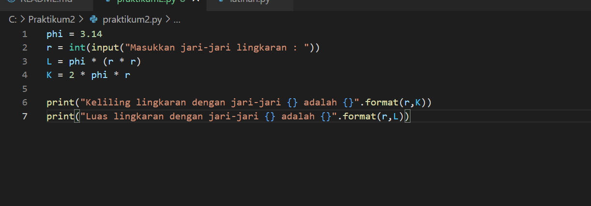
2. Masukkan jari-jari lingkaran. Misalnya jari-jarinya 5, maka akan muncul hasilnya seperti ini :

## Flowchart Menghitung Keliling dan Luas Lingkaran

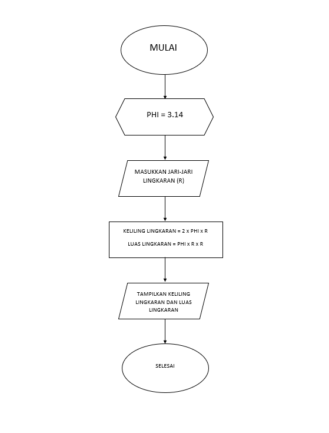

## Penjelasan Lab 1

### Penggunaan END

Misalnya script seperti ini

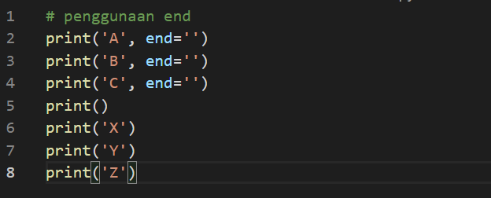

Maka outputnya akan muncul seperti ini

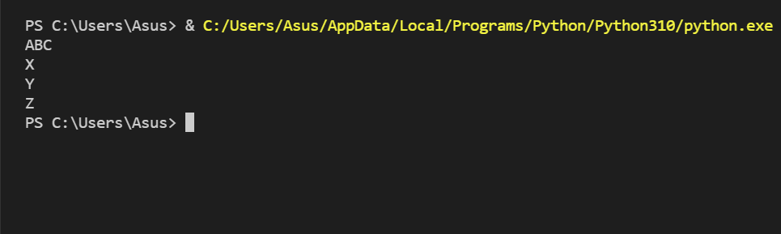

Jika menggunakan 'end' maka akan menghasilkan kesamping, namun jika tidak akan kebawah

### Penggunaan Separator

Misalnya script seperti ini

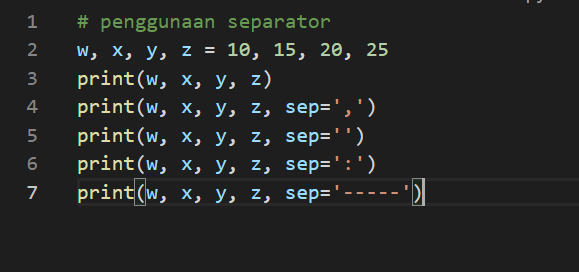

Maka outputnya akan muncul seperti ini 

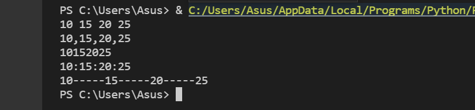

Penggunaan separator akan menghasilkan output pemisah seperti 
sep=',' akan menghasilkan output dengan pemisah koma
sep=':' akan menghasilkan output dengan pemisah titik dua
dan sebagainya

### Penggunaan String Format

Misalnya script seperti ini

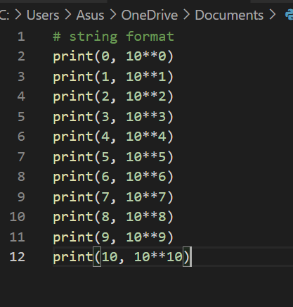

Maka outputnya akan muncul seperti ini

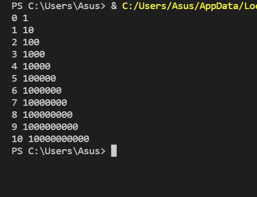

Hasil output akan dimulai dari sebelah kiri dan akan dikalikan 10 dari angka sebelumnya

Namun jika scriptnya seperti ini 

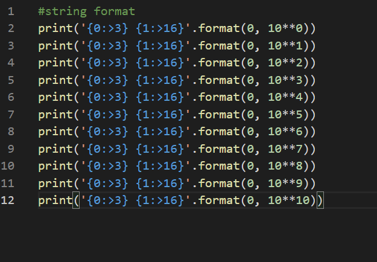

Maka outputnya akan muncul seperti ini

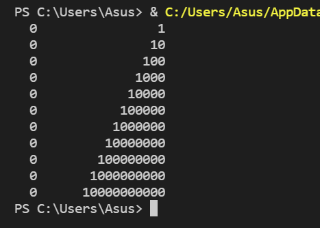

Hasil outputnya akan dimulai dari sebelah kanan dan dikalikan 10 dari angka sebelumnya

## Penjelasan Lab 2

Lab 2 merupakan program penggabungan, penjumlahan, dan pembagian. Scriptnya seperti ini :

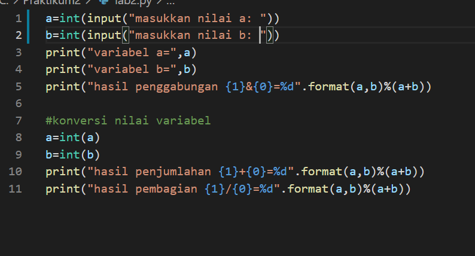

Misalnya kita masukkan nilai a=5 dan b=8, maka outputnya akan seperti ini :

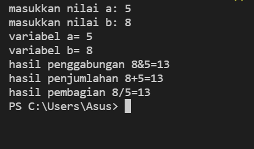

-SEKIAN-