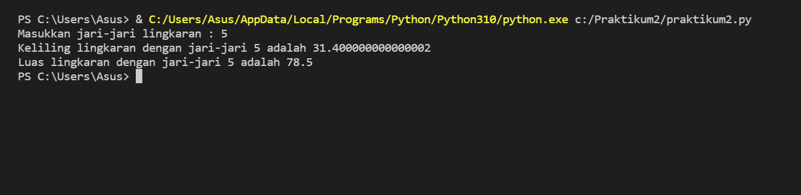

# Praktikum2

## Program Menghitung Luas dan Keliling Lingkaran

1. Buatlah Script seperti ini :

2. Masukkan jari-jari lingkaran. Misalnya jari-jarinya 5, maka akan muncul hasilnya seperti ini :

-SEKIAN-

## Flowchart Menghitung Keliling dan Luas Lingkaran

